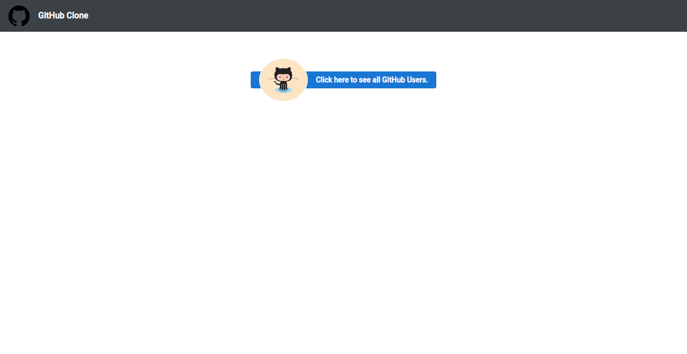
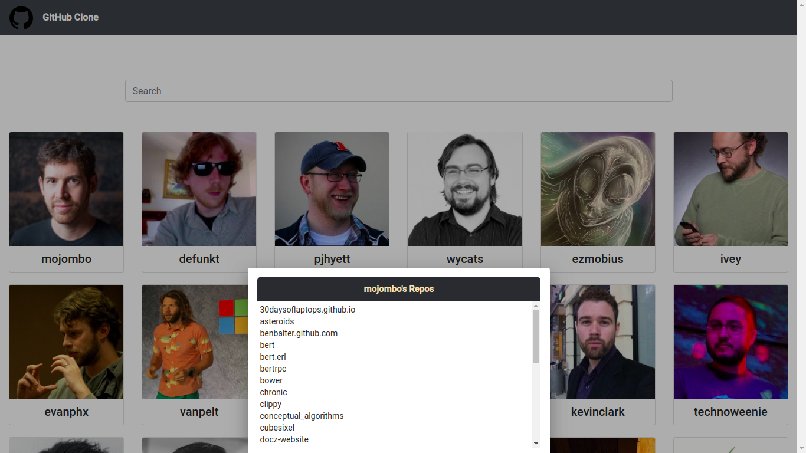
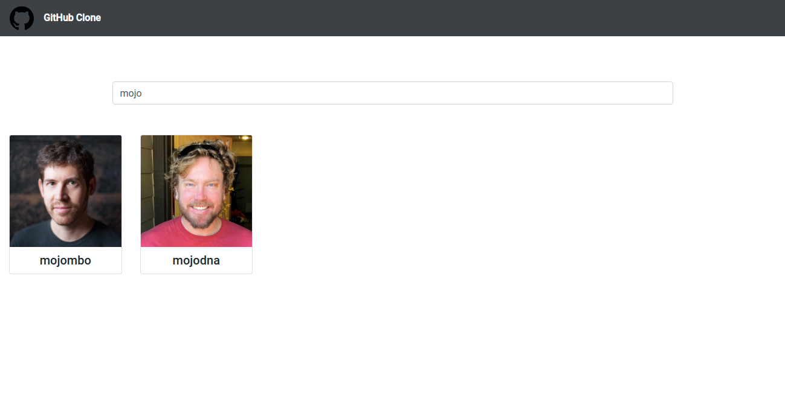

# appinessTest
  Simple Application to list all GitHub users. 

## Dependencies
- @angular/material
- @angular/animations
- bootstrap
- ngx-spinner

## Instructions to Run the application
- Cone the project.
- Use command `cd appinessTest` to move in to the repository.
- Use command `npm install` to install dependencies.
- Use command `ng serve` to serve the application.
  
## Features
- List all github users 
- On click of any user all repositories associated with that user will be displayed
- User search functionality ( Search By username)

## 
## Screenshots
### Home

### All Users List

### Users Repos

### Search User By username

